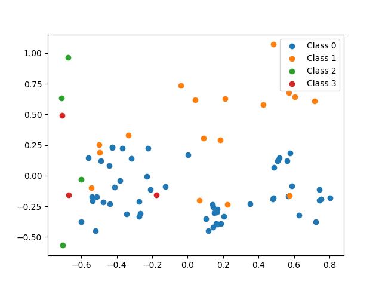

# Clustering Cereal Based On Ingredients

In this tutorial, we will predict the which cereals would belong in the same category as other cereals, based on their ingredients and nutrition information. To do this, we will be using the Mean Shift algorithm.

The source code for each part can be found in the [GitHub Repository](https://github.com/MLMadeSimple/Python-Machine-Learning-Tutorials/tree/main/Clustering/Clustering%20Cereal%20Based%20On%20Ingredients).

## Contents
- [Part 1 - The Data](#part-1---the-data)
- [Part 2 - Loading Data and Cleaning](#part-2---loading-data-and-cleaning)
- [Part 3 - Feature Selection](#part-3---feature-selection)
- [Part 4 - Building the Model](#part-4---building-the-model)
- [Part 5 - Graphing the Data](#part-5---graphing-the-data)
- [Final Code](#final-code)

## Part 1 - The Data
The data set which will be used in this tutorial will come from the user [crawford](https://www.kaggle.com/crawford) over on www.kaggle.com and can be found at https://www.kaggle.com/crawford/80-cereals.

Crawford, Chris. “80 Cereals.” https://www.kaggle.com/crawford/80-cereals, 2017. 

The following is a small sample of the data which will be used.
| name                      | mfr | type | calories | protein | fat | sodium | fiber | carbo | sugars | potass | vitamins | shelf | weight | cups | rating    | 
|---------------------------|-----|------|----------|---------|-----|--------|-------|-------|--------|--------|----------|-------|--------|------|-----------| 
| 100% Bran                 | N   | C    | 70       | 4       | 1   | 130    | 10    | 5     | 6      | 280    | 25       | 3     | 1      | 0.33 | 68.402973 | 
| 100% Natural Bran         | Q   | C    | 120      | 3       | 5   | 15     | 2     | 8     | 8      | 135    | 0        | 3     | 1      | 1    | 33.983679 | 
| All-Bran                  | K   | C    | 70       | 4       | 1   | 260    | 9     | 7     | 5      | 320    | 25       | 3     | 1      | 0.33 | 59.425505 | 
| All-Bran with Extra Fiber | K   | C    | 50       | 4       | 0   | 140    | 14    | 8     | 0      | 330    | 25       | 3     | 1      | 0.5  | 93.704912 | 

Most of the columns are self-explanatory so a description will not be included. If you wish to get more information on any of these columns, please view the data set over on www.kaggle.com (https://www.kaggle.com/crawford/80-cereals)

## Part 2 - Loading Data and Cleaning
Our first job will be to read the data set into memory. This will be done with the Pandas library. Pandas can be installed via PIP (Assuming you have Python and PIP installed already). Pandas is a very large library, but it is my favourite libaray for data processing and management.

We will also need sklearn and matplotlib.
```bash
pip install pandas
pip install matplotlib
pip install sklearn
```

We will use the following code to read the file into memory for further processing. This file can be found in this repository as part2.py. Make sure to change `cereal.csv` to the location of the downloaded data set if it is not in the same directory as your Python script.

```python
import pandas as pd

df = pd.read_csv("cereal.csv")

print(df)
```

If you run this script, and everything installed correctly, you should see the following contents in your console (or something similar to). You may see more or less columns than what is displayed here.
```
                         name mfr type  ...  weight  cups     rating
0                   100% Bran   N    C  ...     1.0  0.33  68.402973
1           100% Natural Bran   Q    C  ...     1.0  1.00  33.983679
2                    All-Bran   K    C  ...     1.0  0.33  59.425505
3   All-Bran with Extra Fiber   K    C  ...     1.0  0.50  93.704912
4              Almond Delight   R    C  ...     1.0  0.75  34.384843
..                        ...  ..  ...  ...     ...   ...        ...
72                    Triples   G    C  ...     1.0  0.75  39.106174
73                       Trix   G    C  ...     1.0  1.00  27.753301
74                 Wheat Chex   R    C  ...     1.0  0.67  49.787445
75                   Wheaties   G    C  ...     1.0  1.00  51.592193
76        Wheaties Honey Gold   G    C  ...     1.0  0.75  36.187559

[77 rows x 16 columns]
```

Before we can do anything with this data, we first need to convert our categorical variables into numerical variables. There are three categorical columns in this data set, `name`, `mfr`, and `type`. I will only be converting the `type` to numerical using a label encoder as I did not think `name` and `mfr` are nessisary for this project.

The `sklearn` library has a great implementation of the LabelEncoder, but because this label encoding is so simple, we can do it ourselves in two lines. Basically `type` refers to if the cereal is served hot (`H`), or cold (`C`). In this specific case, we can say that `Hot` is greater than `Cold`, so we can logically set all values of `H` to 1, and all values of `C` to 0.

This can be done by adding the following two lines:
```python
df.loc[df["type"] == "C", 'type'] = 0
df.loc[df["type"] == "H", 'type'] = 1
```

So our final code will look like this:
```python
import pandas as pd

df = pd.read_csv("cereal.csv")

df.loc[df["type"] == "C", 'type'] = 0
df.loc[df["type"] == "H", 'type'] = 1

print(df)
```

When this is run, you should get the following output:
```
                         name mfr type  ...  weight  cups     rating
0                   100% Bran   N    0  ...     1.0  0.33  68.402973
1           100% Natural Bran   Q    0  ...     1.0  1.00  33.983679
2                    All-Bran   K    0  ...     1.0  0.33  59.425505
3   All-Bran with Extra Fiber   K    0  ...     1.0  0.50  93.704912
4              Almond Delight   R    0  ...     1.0  0.75  34.384843
..                        ...  ..  ...  ...     ...   ...        ...
72                    Triples   G    0  ...     1.0  0.75  39.106174
73                       Trix   G    0  ...     1.0  1.00  27.753301
74                 Wheat Chex   R    0  ...     1.0  0.67  49.787445
75                   Wheaties   G    0  ...     1.0  1.00  51.592193
76        Wheaties Honey Gold   G    0  ...     1.0  0.75  36.187559

[77 rows x 16 columns]
```

## Part 3 - Feature Selection
Now, we must select the features we wish to use in the classification process. The following is a list of features I think are ones we should use. If you disagree, feel free to proceed with using features you think should be used. Remember that there is no right answer in this stage.

- type
- calories
- protein
- fat
- sodium
- fiber
- carbo
- sugars
- potass
- vitamins
- shelf
- weight
- cups

In order to select these features, we will use the following code to store all of that information into the variable `X`. While it is bad practice to use single letter variable names, and variable names should always be lowercase in Python (unless it is a constant), this case is nessisary in order to follow Linear Algebra and Statistics conventions. Note that if you want to use different features than the ones I have selected, feel free to modify the features being selected for training.
```python
X = df[[
    "type", "calories", "protein", "fat", "sodium", "fiber", "carbo", "sugars", "potass",
    "vitamins", "shelf", "weight", "cups"
]]
```

And to select our labels, we can use the following code:
```python
y = df["name"]
```

At this point, our full code looks like this:
```python
import pandas as pd

df = pd.read_csv("cereal.csv")

df.loc[df["type"] == "C", 'type'] = 0
df.loc[df["type"] == "H", 'type'] = 1

X = df[[
    "type", "calories", "protein", "fat", "sodium", "fiber", "carbo", "sugars", "potass",
    "vitamins", "shelf", "weight", "cups"
]]

y = df["name"]

print(X)
print(y)
```

And running this should yeild the following output:
```
   type  calories  protein  fat  sodium  ...  potass  vitamins  shelf  weight  cups
0     0        70        4    1     130  ...     280        25      3     1.0  0.33
1     0       120        3    5      15  ...     135         0      3     1.0  1.00
2     0        70        4    1     260  ...     320        25      3     1.0  0.33
3     0        50        4    0     140  ...     330        25      3     1.0  0.50
4     0       110        2    2     200  ...      -1        25      3     1.0  0.75
..  ...       ...      ...  ...     ...  ...     ...       ...    ...     ...   ...
72    0       110        2    1     250  ...      60        25      3     1.0  0.75
73    0       110        1    1     140  ...      25        25      2     1.0  1.00
74    0       100        3    1     230  ...     115        25      1     1.0  0.67
75    0       100        3    1     200  ...     110        25      1     1.0  1.00
76    0       110        2    1     200  ...      60        25      1     1.0  0.75

[77 rows x 13 columns]
0                     100% Bran
1             100% Natural Bran
2                      All-Bran
3     All-Bran with Extra Fiber
4                Almond Delight
                ...            
72                      Triples
73                         Trix
74                   Wheat Chex
75                     Wheaties
76          Wheaties Honey Gold
Name: name, Length: 77, dtype: object
```

## Part 4 - Building the Model
Now it is finally time to build the model! The following code can be used to acomplish this task.
```python
import numpy as np
import pandas as pd
from sklearn.cluster import MeanShift, estimate_bandwidth

df = pd.read_csv("cereal.csv")

df.loc[df["type"] == "C", 'type'] = 0
df.loc[df["type"] == "H", 'type'] = 1

X = df[[
    "type", "calories", "protein", "fat", "sodium", "fiber", "carbo", "sugars", "potass",
    "vitamins", "shelf", "weight", "cups"
]]

y = df["name"]

bandwidth = estimate_bandwidth(X, quantile=0.2, n_samples=500)
print(bandwidth)

model = MeanShift(bandwidth=bandwidth)
model.fit(X)

labels = model.labels_

labels_unique = np.unique(labels)
n_clusters = len(labels_unique)

print(n_clusters)

final_df = df.merge(pd.DataFrame(labels, columns=["result"]), left_index=True, right_index=True)
final_df.to_csv("cereal_prediction.csv")
```

When I ran the code, I got the follwing output. Note that results may vary depnding on which features you used to train the model.
```
84.86341470763044
4
```

So what is going on here? This is the same code we have been using so far, up until the following line:
```python
bandwidth = estimate_bandwidth(X, quantile=0.2, n_samples=500)
print(bandwidth)
```

The MeanShift algorithm is nice because we do not need to tell it the number of clusters we wish to end up with. Some cases being able to set this would be ideal, however, this is not one of those cases. Instead, we need to come up with the `bandwidth` to train the model with. How this algorithm works, and what badwidth is and does is outside the scope of this tutorial. If you wish to learn more about the MeanShift algorithm, I invite you to check out my latest book which explains how this and other machine learning algorithms work with an example. It can be found at https://www.amazon.com/dp/B08YXWZ4HC.

Next, we build the MeanShift model, and train it using our data:
```python
model = MeanShift(bandwidth=bandwidth)
model.fit(X)
```

Once training is complete, we can retrieve a list of the labels. This is essentailly a numpy array containing the category each of our training data belongs to. The first item of this array correlates to the first value in our data frame. After getting our labels, we take only unique items from that list, and count the number of unique items. This gives us the number of clusters the algorithm created.
```python
labels = model.labels_

labels_unique = np.unique(labels)
n_clusters = len(labels_unique)

print(n_clusters)
```

After this is finished, we can merge the labels assigned to each of our training data with our original data frame. This is done with the following code:
```python
final_df = df.merge(pd.DataFrame(labels, columns=["result"]), left_index=True, right_index=True)
```

Here, we stary by converting the predicted lables to a new data frame:
```python3
pd.DataFrame(labels, columns=["result"])
```

Next, we take that data frame, and merge it with our original data frame to get our final data frame.

Once we have our final data frame, we can write that data frame to disk as a new CSV file:
```python
final_df.to_csv("cereal_prediction.csv")
```

The CSV file can be found in the same directory as the python script under the name `cereal_prediction.csv`. I encourage you to open the file in an CSV editor like Excel and see which cereals ended up in the same cluster as other cereals.

## Part 5 - Graphing the Data
Finally we want to graph our data to see a visual representation of our clusters, but there is a small problem. I chose to use 13 features to train the model. This means that we are working with 13-dimensional data! We can not comprehend what 13-dimensional space looks like, so creating a 13D graph is not an option. Instead, we need to perform a process called "Dimensionality Reduction". The algorithm we will be using to acomplish this task is the Principal Component Analysis (PCA) algorithm.

PCA has the option to reduce the data to 2, 3, or more dimensions. In this tutorial we will use 2 dimensions.

This can be achieved with the follwing code:
```python
import numpy as np
import pandas as pd
from matplotlib import pyplot as plt
from sklearn.cluster import MeanShift, estimate_bandwidth
from sklearn.decomposition import PCA as sklearnPCA

df = pd.read_csv("cereal.csv")

df.loc[df["type"] == "C", 'type'] = 0
df.loc[df["type"] == "H", 'type'] = 1

X = df[[
    "type", "calories", "protein", "fat", "sodium", "fiber", "carbo", "sugars", "potass",
    "vitamins", "shelf", "weight", "cups"
]]

y = df["name"]

bandwidth = estimate_bandwidth(X, quantile=0.2, n_samples=500)

model = MeanShift(bandwidth=bandwidth)
model.fit(X)

labels = model.labels_
cluster_centers = model.cluster_centers_

labels_unique = np.unique(labels)
n_clusters = len(labels_unique)

X_norm = (X - X.min())/(X.max() - X.min())
pca = sklearnPCA(n_components=2)
transformed = pd.DataFrame(pca.fit_transform(X_norm))

for k in range(n_clusters):
    class_points = transformed[labels[transformed.index] == k]
    plt.scatter(class_points[0], class_points[1], label='Class {}'.format(k))

plt.legend()
plt.show()
```

I got the following graph when I ran this code:



Note that the data points do look quite scattered, and certian data points in a cluster look like they should belong to another cluster, but remember that this is just a projection of the 13D data.

What is going on here? This is the same code as before up until we calculate the matrix norm (stored as `X_norm`) which is done in the following line:
```python
X_norm = (X - X.min())/(X.max() - X.min())
```

From there, we can create our PCA converter like so, and use it to transform our 13 dimensional data down to 2 dimensions.
```python
pca = sklearnPCA(n_components=2)
transformed = pd.DataFrame(pca.fit_transform(X_norm))
```

Next, for each cluster created, we select teh points which belong to that cluster, and create a scatter plot graph of all the data:
```python
for k in range(n_clusters):
    class_points = transformed[labels[transformed.index] == k]
    plt.scatter(class_points[0], class_points[1], label='Class {}'.format(k))
```

Finally, we enable the legend on the graph, and show it:
```python
plt.legend()
plt.show()
```

## Final Code

Here is the final code created for this tutorial with everything included. I hope you enjoyed this tutorial, and learned something from it. Thanks and have a nice day!
```python
import numpy as np
import pandas as pd
from matplotlib import pyplot as plt
from sklearn.cluster import MeanShift, estimate_bandwidth
from sklearn.decomposition import PCA as sklearnPCA

df = pd.read_csv("cereal.csv")

df.loc[df["type"] == "C", 'type'] = 0
df.loc[df["type"] == "H", 'type'] = 1

X = df[[
    "type", "calories", "protein", "fat", "sodium", "fiber", "carbo", "sugars", "potass",
    "vitamins", "shelf", "weight", "cups"
]]

y = df["name"]

bandwidth = estimate_bandwidth(X, quantile=0.2, n_samples=500)

model = MeanShift(bandwidth=bandwidth)
model.fit(X)

labels = model.labels_
cluster_centers = model.cluster_centers_

labels_unique = np.unique(labels)
n_clusters = len(labels_unique)

# Principal Component Analysis (PCA)
X_norm = (X - X.min())/(X.max() - X.min())
pca = sklearnPCA(n_components=2)
transformed = pd.DataFrame(pca.fit_transform(X_norm))

for k in range(n_clusters):
    class_points = transformed[labels[transformed.index] == k]
    plt.scatter(class_points[0], class_points[1], label='Class {}'.format(k))

plt.legend()
plt.show()
```
