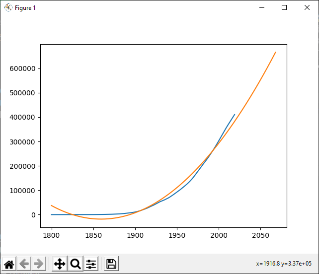

# Predicting Carbon Emission In The US
In this tutorial, we will predict the carbon emissions from the United States of America. The source code for each part can be found in the [GitHub Repository](https://github.com/MLMadeSimple/Python-Machine-Learning-Tutorials/tree/main/Regression/Predicting%20Carbon%20Emission%20In%20The%20US)

## Contents
- [Part 1 - The Data](#part-1---the-data)
- [Part 2 - Loading Data Into Memory](#part-2---loading-data-into-memory)
- [Part 3 - Extracting Data](#part-3---extracting-data)
- [Part 4 - Building a Regression Model](#part-4---building-a-regression-model)
- [Part 5 - Scoring Our Model](#part-5---scoring-our-model)
- [Part 6 - Plotting Our Data](#part-6---plotting-our-data)
- [Part 7 - Making Predictions](#part-7---making-predictions)
- [Final Code](#final-code)

## Part 1 - The Data

The data set which will be used in this tutorial will come from *Our World In Data* and can be found on their website at https://ourworldindata.org/co2-and-other-greenhouse-gas-emissions, or their GitHub repository at https://github.com/owid/co2-data.

The following is a small sample of the data which will be used. At the time of this writing, the data set ranges from 1800 to 2019, and includes every country, but for the sake of this tutorial, we will only focus on the United States.

I have only included columns in this data set which are relevant to our goal. I encourage you to play around with some of the other columns, and other countries after completing this tutorial.

| iso_code | year | co2_per_capita | cumulative_co2 | 
|----------|------|----------------|----------------| 
| USA      | 1800 | 0.037          | 0.253          | 
| USA      | 1801 | 0.039          | 0.52           | 
| USA      | 1802 | 0.041          | 0.81           | 
| USA      | 1803 | 0.041          | 1.107          | 
| USA      | 1804 | 0.045          | 1.44           | 

An explanation on each column in this data set can be found at https://github.com/owid/co2-data/blob/master/owid-co2-codebook.csv. For completeness, I have coppied the description of the columns we will be using in this tutorial from the explanation file.

- **iso_code** - ISO 3166-1 alpha-3 – three-letter country codes
- **year** - Year of observation
- **co2_per_capita** - Average per capita CO2 emissions, measured in tonnes per year.
- **cumulative_co2** - Cumulative emissions of CO2 from 1751 through to the given year, measured in million tonnes.

We will be predicting the `co2_per_capita`, and `cumulative_co2` in this tutorial.

## Part 2 - Loading Data Into Memory

Our first job will be to read the data set into memory. This will be done with the Pandas library. Pandas can be installed via PIP (Assuming you have Python and PIP installed already). Pandas is a very large library, but it is my favourite libaray for data processing and management.

We will also need Numpy, and matplotlib. Pandas, Numpy, and matplotlib are two of the best tools for working with data.

```bash
pip install pandas
pip install numpy
pip install matplotlib
pip install sklearn
```

We will use the following code to read the file into memory for further processing. This file can be found in this repository as `part2.py`. Make sure to change `owid-co2-data.csv` to the location of the downloaded data set if it is not in the same directory as your Python script.

```python
import pandas as pd

df = pd.read_csv("owid-co2-data.csv")

print(df)
```

If you run this script, and everything installed correctly, you should see the following contents in your console (or something similar to). You may see more or less columns than what is displayed here.
```
      iso_code      country  year  ...  energy_per_gdp  population           gdp
0          AFG  Afghanistan  1949  ...             NaN   7663783.0           NaN
1          AFG  Afghanistan  1950  ...             NaN   7752000.0  1.949480e+10
2          AFG  Afghanistan  1951  ...             NaN   7840000.0  2.006385e+10
3          AFG  Afghanistan  1952  ...             NaN   7936000.0  2.074235e+10
4          AFG  Afghanistan  1953  ...             NaN   8040000.0  2.201546e+10
...        ...          ...   ...  ...             ...         ...           ...
23703      ZWE     Zimbabwe  2015  ...             NaN  13815000.0  2.503057e+10
23704      ZWE     Zimbabwe  2016  ...             NaN  14030000.0  2.515176e+10
23705      ZWE     Zimbabwe  2017  ...             NaN  14237000.0           NaN
23706      ZWE     Zimbabwe  2018  ...             NaN  14439000.0           NaN
23707      ZWE     Zimbabwe  2019  ...             NaN  14645000.0           NaN

[23708 rows x 55 columns]
```

If you get an error message, where the last line is something along the lines of:
```
FileNotFoundError: [Errno 2] No such file or directory: 'owid-co2-data.csv'
```

It means the script was unable to locate your CSV file, and it could not be read. Check where the CSV data set is saved, and where your Python script is, and make sure all the paths are correct.

So, what just happened? First, we imported Pandas. Easy.
```python
import pandas as pd
```

Next, we used Pandas to read our CSV file. This creates a new object called a `DataFrame` and stores it into our `df` variable (`df` is short for `dataframe`). The `DataFrame` object allows us to query, maniplulate, and perform many operations on our data set without the need for much code.
```python
df = pd.read_csv("owid-co2-data.csv")
```

Finally, we printed out the dataframe, but, if you look at the output, we can only see *part* of the dataframe. This is because Pandas will only print the first and last few columns and rows in the dataframe so you can still see everything without lines getting wrapped because of your console size.

## Part 3 - Extracting Data
This dataset contains data from every country. In our project, all we want is the data from a single counrty, the United States. To acomplish this, we will need to pull a subset of our dataset where the `iso_code` is `USA`.

This can be done with the following code:
```python
import pandas as pd

df = pd.read_csv("owid-co2-data.csv")

mask = df["iso_code"] == "USA"
df = df.loc[mask]

print(df)
```

Running this will create the following output:
```
      iso_code        country  year  ...  energy_per_gdp   population           gdp
22369      USA  United States  1800  ...             NaN    6801854.0           NaN
22370      USA  United States  1801  ...             NaN    6933517.0           NaN
22371      USA  United States  1802  ...             NaN    7067728.0           NaN
22372      USA  United States  1803  ...             NaN    7204538.0           NaN
22373      USA  United States  1804  ...             NaN    7343995.0           NaN
...        ...            ...   ...  ...             ...          ...           ...
22584      USA  United States  2015  ...           1.523  320878016.0  1.690000e+13
22585      USA  United States  2016  ...           1.496  323016000.0  1.720000e+13
22586      USA  United States  2017  ...             NaN  325084992.0           NaN
22587      USA  United States  2018  ...             NaN  327096000.0           NaN
22588      USA  United States  2019  ...             NaN  329064992.0           NaN

[220 rows x 55 columns]
```

We now have a subset of our original data for the United States only.

After creating our data frame, we created a mask of rows where the `iso_code` is `USA`. Basically, a mask is a list containing the index of rows which meet our condition
```python
mask = df["iso_code"] == "USA"
```

Next, we apply our mask to our data frame to get our new data frame. If you would like data from other countries after this operation, I recomend assigning the data frame to a different variable so the original data frame can be reused.
```python
df = df.loc[mask]
```

Then we print the data frame to the console, just like last time.
```python
print(df)
```

## Part 4 - Building a Regression Model
This is where Numpy comes into play. To acomplish this task, we will use the folloing code:
```python
import pandas as pd
import numpy as np

df = pd.read_csv("owid-co2-data.csv")

mask = df["iso_code"] == "USA"
df = df.loc[mask]

x = df["year"]
y = df["cumulative_co2"]

model = np.poly1d(np.polyfit(x, y, 2))

print(model)
```

When I ran this, I got the following output:
```
       2
15.73 x - 5.849e+04 x + 5.436e+07
```

This is the function of the polynomial which we will use as our model. If you are unsure what a polynomial is, do not worry. You do not need to know about polynomials to follow along with this tutorial, and infact, polynomials are outside the scope of this tutorial.

After applying our mask from the previous section, we then create two variables. Generally it is bad practice to name variables things like `x` and `y`, but this case is different. In this case `x` will contain a set of numbers which run along the `x` axis. This set of numbers is called a `Series`. We extract all the numbers in the `year` column, and store that in our `x` variable.
```python
x = df["year"]
```

Next, we do the same, but for the `y` axis. We will start by predicting `cumulative_co2`, so we will assign all of the data in the `cumulative_co2` column that to the variable `y`.
```python
y = df["cumulative_co2"]
```

The next step is where things get interesting. We can create our model to predict the `cumulative_co2` in future years. This is done with the following code. Notice the `2` which is the final parameter of `np.polyfit(x, y, 2)`. This is the degree of the regression model we will use for the prediction. This tutorial is focused on how to perform the prediction, and less on how this actually works (the algorithm behind this). If you wish to learn more about how this, and other machine learning algorithms work, please check out my book [Algorithm Introduction](https://www.amazon.com/dp/B08YXWZ4HC).

The higher the degree, the more flexible our model will be. So why `2` and not `100`? A higher degree generally causes the model to more closley fit our data, but as the degree goes up, so does our chances of overfitting. This means that our model is so closley fit to our data, that any future or past predictions become useless. To understand this concept better, I encourage you to play around with this number to experience overfitting for yourself.
```python
model = np.poly1d(np.polyfit(x, y, 2))
```

Finally, we print our model to the console:
```python
print(model)
```

## Part 5 - Scoring Our Model
Now that we have created the model, we need to know how good it is at predicting. For this, we will be using the r2 score from the `sklearn` library. The r2 score is a number between 0 and 1 which describes how similar two data sets are. 1 means an exact match which is ideal, and 0 is no similarity at all which means our model is bad. The higher this number, the better model we have. The data sets we will be comparing are the data set from our CSV file (the data point for each year), and the value we estimate for each known year. What the r2 score is and how it is calculated is outside the scope of this tutorial. For more information on it, you can always check out my book If you wish to learn more about how this, and other machine learning algorithms work, please check out my book, [Algorithm Introduction](https://www.amazon.com/dp/B08YXWZ4HC).

This can be accomplished with the following code:
```python
import pandas as pd
import numpy as np
from sklearn.metrics import r2_score

df = pd.read_csv("owid-co2-data.csv")

mask = df["iso_code"] == "USA"
df = df.loc[mask]

x = df["year"]
y = df["cumulative_co2"]

model = np.poly1d(np.polyfit(x, y, 2))

r2 = r2_score(y, model(x))

print(r2)
```

When I ran this code, I got the following output:
```
0.9826747203389289
```

Therefore, our r2 score is about 0.982, so it is extremley high. We can conclude that this model is a good match.

From our model, we can calculate the r2 score:
```python
r2 = r2_score(y, model(x))
```

Which we can then print to the console:
```python
print(r2)
```

## Part 6 - Plotting Our Data
It is about time we actually see our model in action. This can be achieved with the following code:
```python
import pandas as pd
import numpy as np
from sklearn.metrics import r2_score
import matplotlib.pyplot as plt

df = pd.read_csv("owid-co2-data.csv")

mask = df["iso_code"] == "USA"
df = df.loc[mask]

x = df["year"]
y = df["cumulative_co2"]

model = np.poly1d(np.polyfit(x, y, 2))

r2 = r2_score(y, model(x))

x_hat = x.append(pd.Series(range(x.max() + 1, x.max() + 50)))
y_hat = model(x_hat)

plt.plot(x, y)
plt.plot(x_hat, y_hat)
plt.show() 
```

Running this code will cause the following window to appear:



We start by calculating new varialbes called `x_hat` and `y_hat`. The `_hat` suffix is simply there to indicate this is a projected, or predicted version of the original variable.

`x_hat` is created to be a concatanation of every known year in the original data set, plus the next 50 years. This way we will not only be able to visualize the known data and the model, but also the next 50 years plotted with the data. Feel free to change this number to anything you want. If you want to remove the visualization of future years, simply change the line to `x_hat = x`. As an added challenge, try to also include years *before* the first year in the data set.
```python
x_hat = x.append(pd.Series(range(x.max() + 1, x.max() + 50)))
```

`y_hat` is then calculated by predicting a value for each year in `x_hat`
```python
y_hat = model(x_hat)
```

Finally, we plot the data. We start by plotting the known data in the CSV file (`x` and `y`), followed by the projected data (`x_hat`, and `y_hat`) and then display the final plot:
```python
plt.plot(x, y)
plt.plot(x_hat, y_hat)
plt.show() 
```

## Part 7 - Making Predictions
Now that we have our model, and are happy with it, lets add some code so we can make some predictions given a year. This can be done with the following code:
```python
import pandas as pd
import numpy as np
from sklearn.metrics import r2_score
import matplotlib.pyplot as plt

df = pd.read_csv("owid-co2-data.csv")

mask = df["iso_code"] == "USA"
df = df.loc[mask]

x = df["year"]
y = df["cumulative_co2"]

model = np.poly1d(np.polyfit(x, y, 2))

r2 = r2_score(y, model(x))

while True:
    x_hat = int(input("Enter a year: "))
    
    y_hat = model(x_hat)
    print("{} = {}".format(x_hat, y_hat))
```

When this code is run, you will get a prompt `Enter a year: `. Simply enter a year and press `ENTER` to recieve the projection for that year. For example:
```
Enter a year: 2025
2025 = 412717.4364271462

Enter a year: 2050
2050 = 552750.7789828256

Enter a year: 3000
3000 = 20442089.51404263
```

After our model is created, we simply enter an infinite loop where we ask the user to enter a year which is cast to an integer:
```python
x_hat = int(input("Enter a year: "))
```

We then use that year to create a projection:
```python
y_hat = model(x_hat)
```

And finally, we print that year out to the console:
```python
print("{} = {}".format(x_hat, y_hat))
```

The fun thing about this is you could enter any year you wanted to, even billions of years into the future. Remember that the further you predict into the future (or the past) the less accurate the prediction will be (aka predicting 10 years into the future should be ok, but 10,000 years may not be so accurate), and this will only hold true as long as things keep on going the way they already are going.

## Final Code
Here is the final code created for this tutorial with everything included. I hope you enjoyed this tutorial, and learned something from it. Thanks and have a nice day! 

**NOTE**: You must close the plotted window before you may enter a year to make a prediction
```python
import pandas as pd
import numpy as np
from sklearn.metrics import r2_score
import matplotlib.pyplot as plt

df = pd.read_csv("owid-co2-data.csv")

mask = df["iso_code"] == "USA"
df = df.loc[mask]

x = df["year"]
y = df["cumulative_co2"]

model = np.poly1d(np.polyfit(x, y, 2))
print("Model:")
print(model)

r2 = r2_score(y, model(x))
print("r2 = {}".format(r2))

x_hat = x.append(pd.Series(range(x.max() + 1, x.max() + 50)))
y_hat = model(x_hat)

plt.plot(x, y)
plt.plot(x_hat, y_hat)
plt.show()

while True:
    x_hat = int(input("Enter a year: "))
    
    y_hat = model(x_hat)
    print("{} = {}".format(x_hat, y_hat))
```
